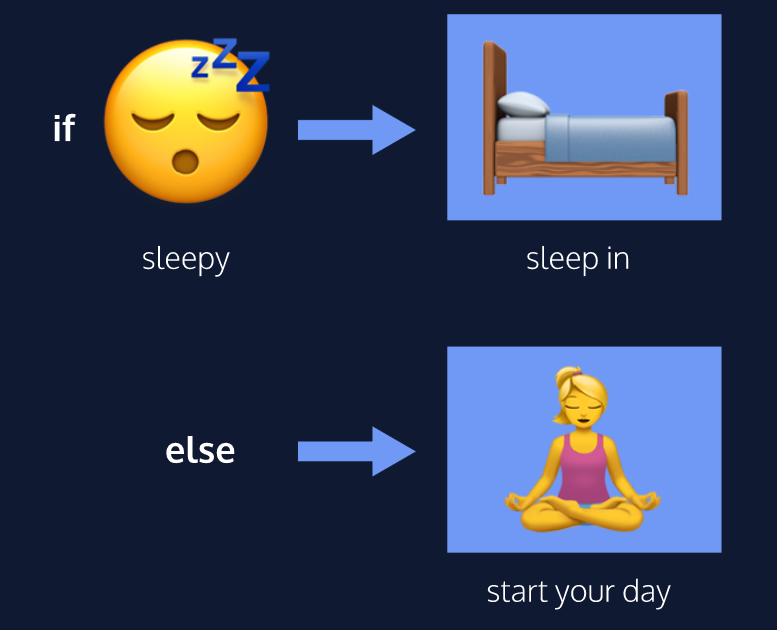

# Conditional Statements


In this guide, we’ll be covering the following concepts:
* `if`, `else if`, and `else` statements
* comparison operators
* logical operators
* truthy vs falsy values
* the `switch` statement

## The `if` Keyword
We often perform a task based on a condition. For example, if the weather is nice today, then we will go outside. If the alarm clock rings, then we’ll shut it off. If we’re tired, then we’ll go to sleep.

```js
if (hungry) {
    console.log('Time to eat!')
}
```

The `if` statement is composed of:
* the `if` keyword followed by a set of **parentheses** `()` which is followed by a code block, or block statement, indicated by a set of **curly braces** `{}`
* inside the parentheses `()`, a **condition** is provided that evaluates to true or false
* if the condition evaluates to **true**, the code inside the curly braces `{}` **runs**, or **executes**
* if the condition evaluates to **false**, the block **won’t execute**!

## `If... Else` Statements
An `else` statement must be paired with an `if` statement, and together they make an `if...else` statement.

```js
if (sleepy) {
    console.log('Time to go to sleep!');
} else {
    console.log('One more episode!');
}
```
 It's pretty simple, think about it that way - if the condition inside your code block is true, execute the block. If it equals to false, do not run the code and replace it with something else!

 [Here is a cool tutorial for y'all](https://youtu.be/N4V0FZASK60)

 ## Comparison Operators
* less than: ``<``
* greater than: ``>``
* less than or equal to: ``<=``
* greater than or equal to: ``>=``
* is equal to: ``===``
* is **not** equal to: ``!==``

## Logical Operators
* the and operator ``&&``
* the or operator ``||``
* the not operator, otherwise known as the bang operator ``!``

## Truthy vs Falsy
The following values are **always falsy**:

* ``false``
* ``0``
* ``' '`` or ``" "`` (empty string)
* ``null``
* ``undefined``
* ``NaN`` (not a number)

Everything else is **truthy**. That includes:

* ``'0'`` (a string containing a single zero)
* ``'false'`` (a string containing the text “false”)
* ``[ ]`` (an empty array)
* ``{ }`` (an empty object)
* ``function(){}`` (an empty function)


 


